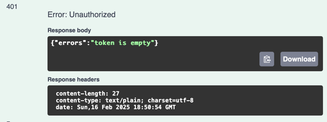

# avito-shop
Внутренний магазин мерча авито
___
### Запуск сервиса

Требования:
- docker

Запуск сервиса производится команлой:
```bash
make run
```
После этого можно перейти на веб интерфейс сваггера:
<http://127.0.0.1:8080/swagger/index.html>

### Сценарии использования сервиса:

\
`POST /api/auth` - аутентификация и получение JWT-токена

здесь необходимо ввести имя и пароль пользователя.
Если такой пользователь еще не зарегестрирован - он автоматически добавляется в бд в таблицу users.
В случа если пользователь с таким именем уже найден в таблице - сверяем пароль.

В ответе ручки возвращается сам JWT-токен и
также токен проставляется в cookie auth_token

****

При вызове других ручек сначала будем искать токен в cookie auth_token
и, если такой cookie нет, то в хэдере авторизации
___
\
`GET /api/by/{item}` - купить предмет за монеты

здесь вводится название мерча, который авторизированный пользователь хочет купить

так как количество мерча ограничено и нет функционала для изменения и добавления мерча, добавлен инмемори кэш, который хранит в себе 
все возможные значения item'ов

1. данные введены корректно и у пользователя достаточно денег
****


2. введено неправильное название мерча
****


3. пользователь не авторизирован
   ****
___
\
`GET /api/info` - получить информацию о монетах, инвентаре и истории транзакций.
В задании требовалось реализовать возможность видеть _"Сгруппированную информацию о перемещении монеток в его кошельке..."_.
Здесь не очень было понятно что подразумевается под группировкой, поэтому я реализовала это следущим способом:


****

информации о получениях монет группируется по имени отправителя: пользователь видит количество монет получаенное суммарно от пользователя за все время

аналогично с отправленными: группируем по имени получателя 

информация о том, сколько осталось монет

купленные товары - тип и колличество купленного мерча за все время

1. пользователь авторизован - может посмотреть информацию
**** 


2. пользователь не авторизован - ошибка
****

___

`POST /api/sendCoin` - отправить монеты другому пользователю

здесь так же при корректно введенных данных возвращается 200 ok

какие могут возникнуть ошибки (примеры):

1. недостаточно денег
   ****

2. нельзя переводить самому себе
   ****

3. пользователь не авторизирован
   ****

___
### Детали реализации

Время ответ от 1 до 4 мс, но аутентификация занимает больше времени из-за шифрования, хэша и тд

Провести нагрузочное тестирование не удалось, при нагрузке до 100к время ответа должно увеличиться, но не критично 

___
### Тестирование

Покрытие тестами **55,3%**

Реализованы E2E тесты для 2х основных сценариев

**buy_item_test**, который использует три метода в следующем порядке: аутентификация -> получение информации о юзере -> покупка мерча

**send_coin_test**, который использует три метода в следующем порядке: аутентификация -> получение информации о юзере -> перевод монет

Таким образом получилось покрыть весь функционал, за исключением некоторых краевых случаев

Можно также посмотреть информацию про тесты и запустить их, для этого можно использовать последовательность команд:

```bash
# запуск сервиса, так как тесты сразу запускаются вместе с Е2Е тестами
make run

# чтобы запустить тестирование - Unit и E2E
make test

# и посмотреть покрытие кода тестами с помощью 
make go-cover
```

___
### Линтер

```bash
# Чтобы запустить линтер нужно ввести
go lint
```
___
### Архитектура БД

****

